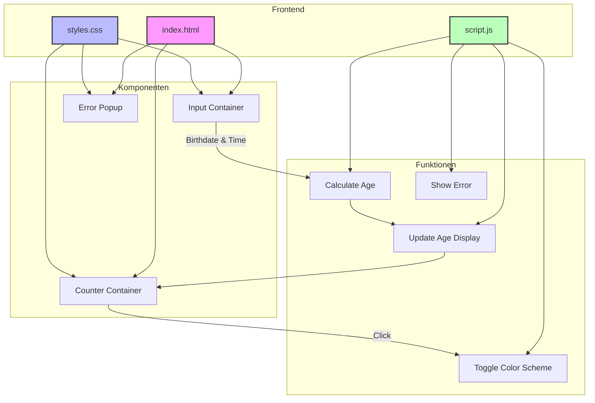

```mermaid
graph TD
    subgraph Frontend
        HTML[index.html]
        CSS[styles.css]
        JS[script.js]
    end
    
    subgraph Komponenten
        Input[Input Container]
        Counter[Counter Container]
        Popup[Error Popup]
    end
    
    subgraph Funktionen
        Calculate[Calculate Age]
        Update[Update Age Display]
        Toggle[Toggle Color Scheme]
        Error[Show Error]
    end
    
    HTML --> Input
    HTML --> Counter
    HTML --> Popup
    
    CSS --> Input
    CSS --> Counter
    CSS --> Popup
    
    JS --> Calculate
    JS --> Update
    JS --> Toggle
    JS --> Error
    
    Input --> |Birthdate & Time| Calculate
    Calculate --> Update
    Update --> Counter
    Counter --> |Click| Toggle
    
    style HTML fill:#f9f,stroke:#333,stroke-width:2px
    style CSS fill:#bbf,stroke:#333,stroke-width:2px
    style JS fill:#bfb,stroke:#333,stroke-width:2px
```
